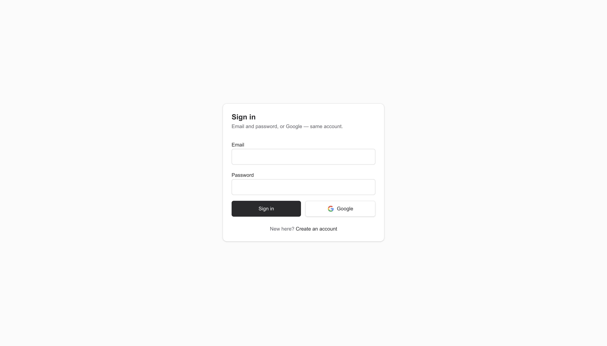
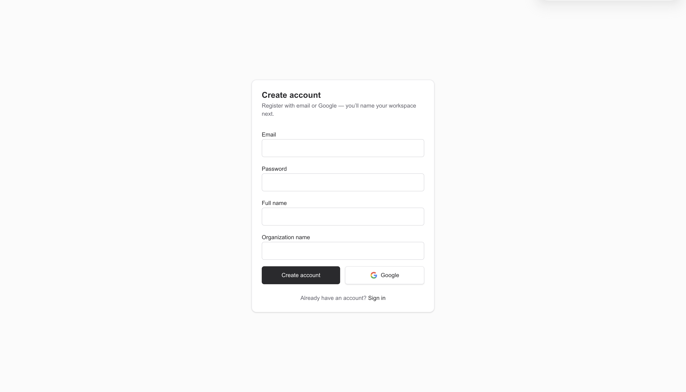
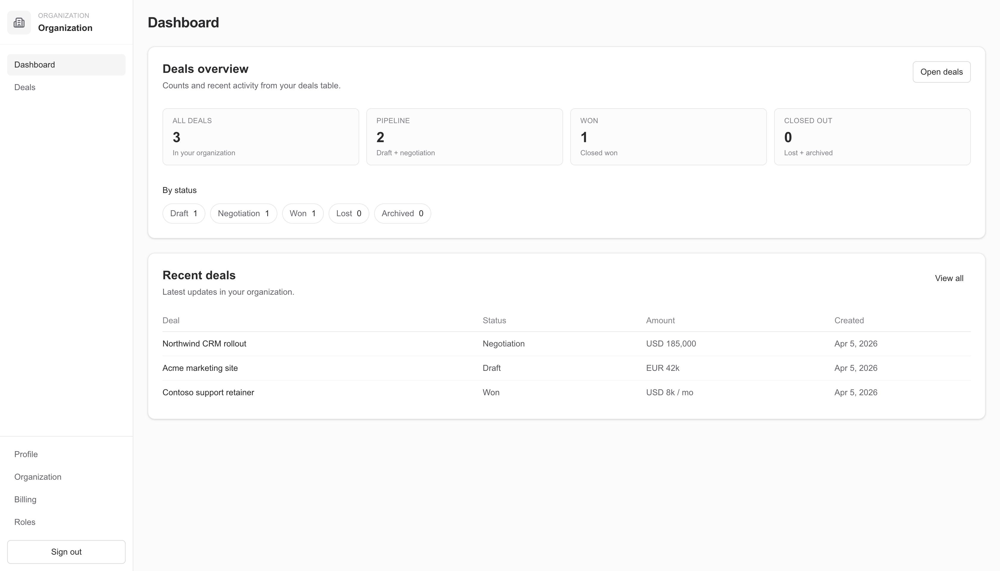
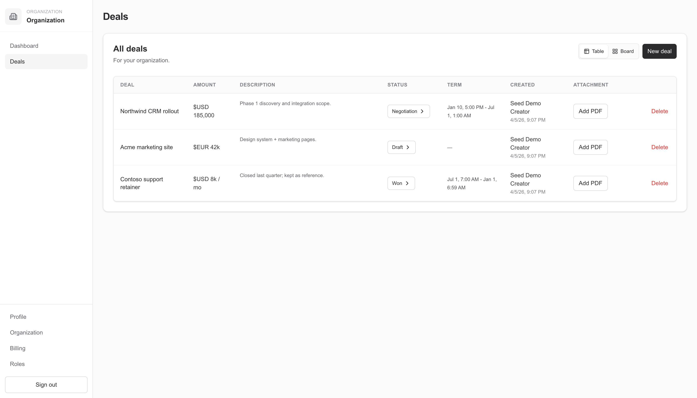
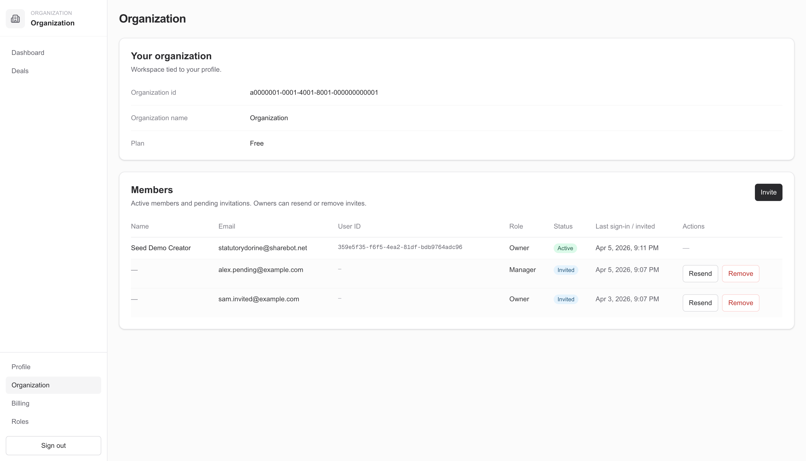
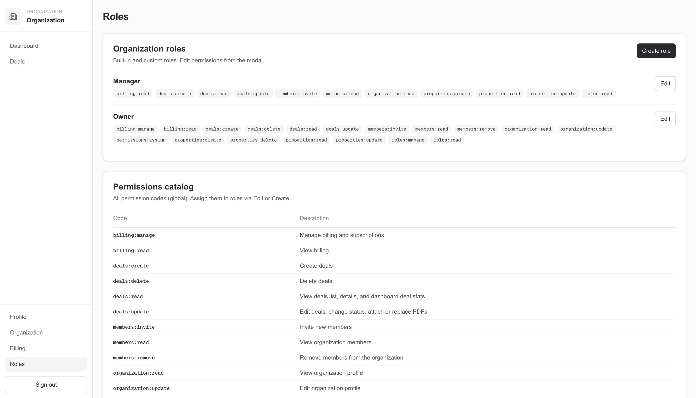
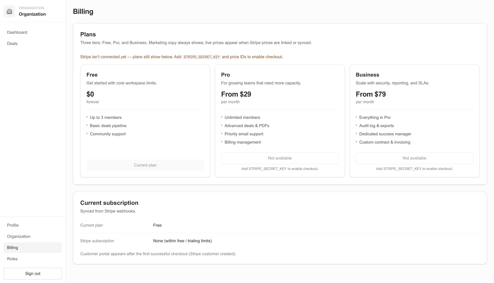
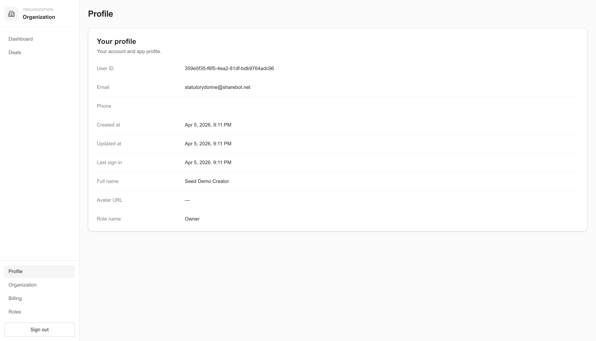

# Next.js + Postgres (Drizzle) + Supabase Auth template

## Screenshots

| Login | Register |
| :---: | :---: |
|  |  |

| Dashboard | Deals |
| :---: | :---: |
|  |  |

| Organization | Roles |
| :---: | :---: |
|  |  |

| Billing | Profile |
| :---: | :---: |
|  |  |

---

The minimum you need for **local development with a working app database** is:

1. **Postgres** and a connection string in `DATABASE_URL`.
2. A **Supabase** project with Auth enabled: `NEXT_PUBLIC_SUPABASE_URL` and `NEXT_PUBLIC_SUPABASE_PUBLISHABLE_DEFAULT_KEY`.
3. **`SUPABASE_SERVICE_ROLE_KEY`** — if you use member invites or deal PDFs (the server calls the Admin API / Storage).

Copy variables from `.env.example` into `.env.local` and fill in your values. Next.js and `drizzle.config.ts` (for migrations) both load `.env.local`.

## Database migrations

The `drizzle/` folder has one SQL migration: **`0000_schema.sql`** — full `public` schema (enums, tables, FKs, indexes). `auth.*` is owned by Supabase and is not included here.

**Reference data** (`plans`, global `permissions`) is **not** in SQL: it is defined in code (`ALL_PLAN_DEFINITIONS` in `src/lib/billing/plans.ts`, `ALL_PERMISSION_DEFINITIONS` in `src/db/role-seed.ts`) and written with `syncGlobalReferenceData()`.

- `npm run db:migrate` applies the migration, then runs that seed (idempotent).
- `npm run db:seed` runs only the reference seed (e.g. after resetting data while keeping tables).

Organizations, roles, and role↔permission links are still created on registration / invite flows (`syncOrgStandardRolePermissions`).

If you had older migration tags (`0001_…`–`0005_…`) recorded in `__drizzle_migrations`, this squash changes history: prefer a fresh database or align the journal with your DB before running `db:migrate`.

**`npm run db:migrate` and `.env.local`:** the script loads `.env.local` from the project root and **overrides** `DATABASE_URL` (and other keys) so it matches what you edited — not an old value exported in the shell. It prints `Database: host:port · database "…"` so you can confirm the target.

**“Nothing happens” / no tables:** Drizzle records applied files in `drizzle.__drizzle_migrations`. If that table says `0000_schema` is already applied, the big `CREATE TABLE` SQL **will not run again**. If you pointed `DATABASE_URL` at a new empty Postgres but reused a DB that still had that row, or you dropped `public` tables by hand, either use a truly fresh database or run `DELETE FROM drizzle.__drizzle_migrations;` (or drop schema `drizzle`) and migrate again.

The `schema "drizzle" already exists` messages were harmless Postgres NOTICEs; the migrate script now silences them.

## Development

```bash
npm install
npm run db:migrate
npm run dev
```

Open [http://localhost:3000](http://localhost:3000).

## Environment variables

| Variable | Purpose |
|----------|---------|
| `DATABASE_URL` | Postgres connection for Drizzle and server actions. With Supabase you often use the pooler (port `6543`); this template disables prepared statements in that mode. |
| `NEXT_PUBLIC_SUPABASE_URL` | Your Supabase project URL (client, middleware, OAuth callbacks). |
| `NEXT_PUBLIC_SUPABASE_PUBLISHABLE_DEFAULT_KEY` | Supabase **publishable** client key (browser + SSR sessions). |
| `SUPABASE_SERVICE_ROLE_KEY` | Service role secret: email invites, PDF uploads to Storage for deals. Never use in client code. |
| `NEXT_PUBLIC_SITE_URL` | Canonical app base URL (post-login redirects, etc.). If unset, `VERCEL_URL` may be used on Vercel. |
| `STRIPE_SECRET_KEY` | Server-side Stripe key for Checkout and API calls. |
| `STRIPE_WEBHOOK_SECRET` | Stripe webhook signing secret (`/api/webhooks/stripe`). |
| `STRIPE_PRO_PRICE_ID` | Fallback Price id for the `pro` plan when `stripe_price_id` is empty in the database. |
| `STRIPE_BUSINESS_PRICE_ID` | Same for the `business` plan. |
| `DEMO_LOGIN_EMAIL` / `DEMO_LOGIN_PASSWORD` | Optional. Override credentials used by **or try DEMO** on login/register. If unset, the template uses built-in demo defaults — change or remove for production. |

## npm scripts

| Script | What it does |
|--------|----------------|
| `npm run dev` | Next.js in development mode. |
| `npm run build` / `npm run start` | Production build and server. |
| `npm run db:migrate` | Apply SQL migrations from `drizzle/`, then seed `plans` + `permissions`. |
| `npm run db:seed` | Idempotent seed for `plans` + global `permissions` only. |
| `npm run lint` | ESLint. |

## Supabase note

App tables live in `public`. Auth users live in `auth.users` (managed by Supabase). `profiles.id` matches `auth.users.id`, but migrations intentionally omit a foreign key to `auth.users` so Drizzle does not try to manage Supabase’s internal auth schema.
